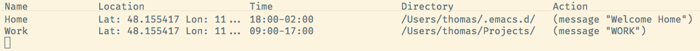

> Bring your editing experience to the next level with context-based actions for emacs


# Installation

```emacs-lisp
(add-to-list 'load-path "path-to-elcontext")
(require 'elcontext)
(elcontext-global-mode)
```


# Usage

Use `M-x elcontext` for on overview of all contexts. Within this overview several hydras will guide through the API, press `?` to open the help hydra.

Contexts can consist of a

-   name,
-   location (only for macOS),
-   timespan,
-   directory,
-   and action.



When all defined context parts are valid the action is triggered once per day.
